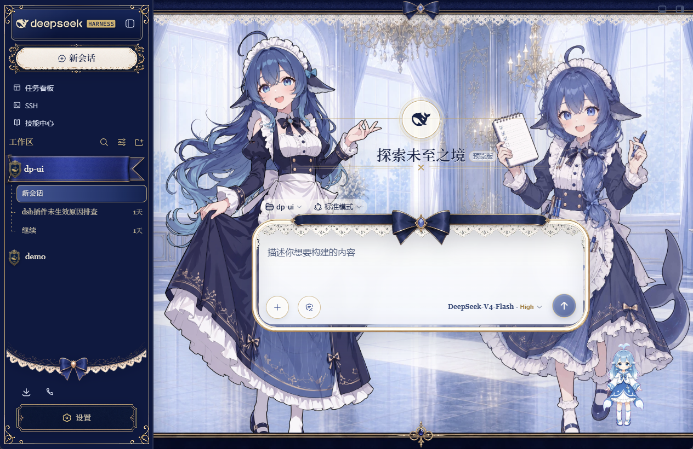
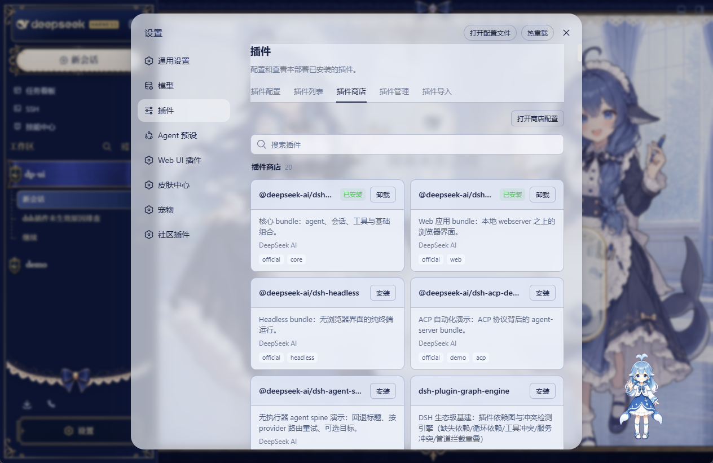
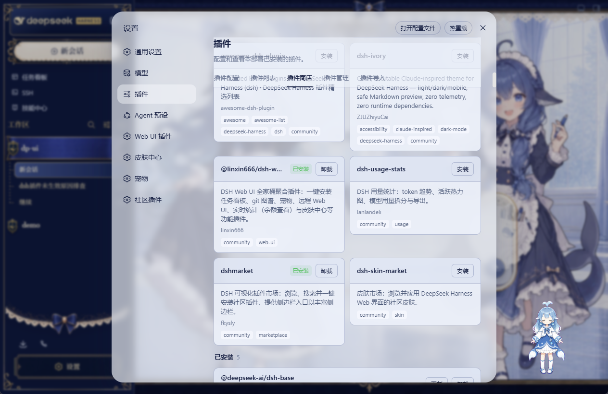
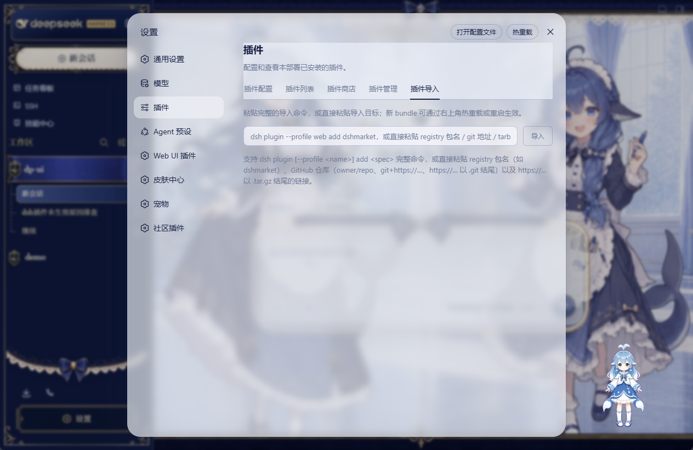

# DeepSeek Harness

[English](README.md) | 中文

## 本发行版新增功能（相对官方 DeepSeek Harness）

> 本仓库在官方 [DeepSeek Harness](https://github.com/deepseek-ai/deepseek-harness) 基础上扩展，新增以下功能模块，随 Windows 桌面版（v1.0.8）与 Web UI 一起交付。

### 桌面版应用与欢迎界面

原生窗口承载 Web UI，目标机器无需安装 Node.js；新会话欢迎页展示当前模型与快捷入口：



### 插件商店

设置页新增「插件商店」标签：浏览官方与社区插件目录、本地搜索、一键安装/卸载/更新（经 `pnpm --profile bundle --reconcile`）、插件条目启停（store patch 层热生效），变更后提示重启：



**推荐安装（社区已验证插件）**：

- `@linxin666/dsh-web-ui-all`：DSH Web UI 全家桶聚合插件——任务看板、git 图谱、宠物、远程 Web UI、实时统计（余额查看）与皮肤中心，一键安装。
- `dshmarket`：DSH 可视化插件市场——浏览、搜索并一键安装社区插件，提供侧边栏入口。
- `dsh-usage-stats`：DSH 用量统计——token 趋势、活跃热力图、模型用量拆分与导出。
- `dsh-skin-market`：皮肤市场——浏览并应用 Web 界面皮肤。
- `dsh-ivory`：Claude-inspired 主题插件，支持 light/dark/mobile 模式。



### 插件导入

支持 `dsh plugin [--profile <name>] add <spec>` 完整命令，或直接粘贴 registry 包名（如 `dshmarket`）、GitHub 仓库（`owner/repo`、`git+https://...`、`.git` 结尾链接）以及 `.tar.gz` 链接；新 bundle 通过右上角「热重载」立即生效或重启生效：



### 更多增强

- **插件热重载**：插件页右上角一键重载，store patch 层变更立即生效，无需重启应用。
- **会话头部余额胶囊**：展示 provider 余额查询结果。
- **一键发版工具链**：`发布桌面版Release.bat`（即 `scripts/release-desktop.ps1`）。

---

DeepSeek Harness（`dsh`）是由 [DeepSeek AI](https://deepseek.com) 开发的开源 agent harness（智能体框架）。

它采用**一切皆插件**的架构，并由 [Cordis](https://github.com/cordiverse/cordis) 驱动，其设计参见论文 [_A Programming Paradigm for Spatiotemporal Composability_](https://github.com/cordiverse/paper)。

## 开发者预览

DeepSeek Harness 目前处于 _开发者预览_ 阶段，正在快速迭代。**未来将出现破坏兼容性的变更。**

## 运行

### 通过 `npm` 运行

安装 `Node.js`，然后运行：

```sh
npx @deepseek-ai/dsh web
```

该命令会启动 Web UI，默认地址为 `http://127.0.0.1:3080`。详见 [Web UI 指南](docs/user/guide/index.md)。

### 从源码运行

如需从仓库源码运行：

```sh
git clone https://github.com/deepseek-ai/deepseek-harness.git
cd deepseek-harness
pnpm install
pnpm run build
pnpm dsh web
```

### 桌面应用

桌面应用在原生窗口中承载 Web UI，目标机器无需安装 Node。从仓库检出构建安装包：

```sh
pnpm install
pnpm run desktop:build
```

安装包产出在 `apps/desktop/dist-release/` —— Windows 为 NSIS 安装器（`win-x64`），macOS 为 dmg（`mac-arm64`）。运行 `pnpm run desktop:dev` 可免打包直接基于源码树打开应用。

## 社区与支持

- 欢迎通过 [GitHub Discussions](https://github.com/deepseek-ai/deepseek-harness/discussions) 提交反馈或 bug 报告。
- 为你的插件仓库添加 [`dsh-plugin`](https://github.com/topics/dsh-plugin) 话题，便于被发现。
- 欢迎加入 DeepSeek Harness 企微群：扫码添加企微小助手并填写入群问卷，完成后小助手会邀请你入群。

<table>
  <thead>
    <tr>
      <th align="center">企微小助手</th>
      <th align="center">入群问卷</th>
      <th align="center">微信公众号</th>
    </tr>
  </thead>
  <tbody>
    <tr>
      <td align="center"></td>
      <td align="center"><a href="https://trtgsjkv6r.feishu.cn/share/base/form/shrcnIt5twSVdLGD52KJBckGCgg"></a></td>
      <td align="center"></td>
    </tr>
  </tbody>
</table>

## 参与贡献

参见 [CONTRIBUTING.md](CONTRIBUTING.md)。

## 开发

请先阅读[开发指南](docs/development.md)与[架构文档](docs/architecture.md)。

面向 agent：请遵循 [AGENTS.md](AGENTS.md)。

## 许可证

[MIT](LICENSE)

第三方依赖及其许可证见 [THIRD_PARTY_NOTICES.md](THIRD_PARTY_NOTICES.md)。
